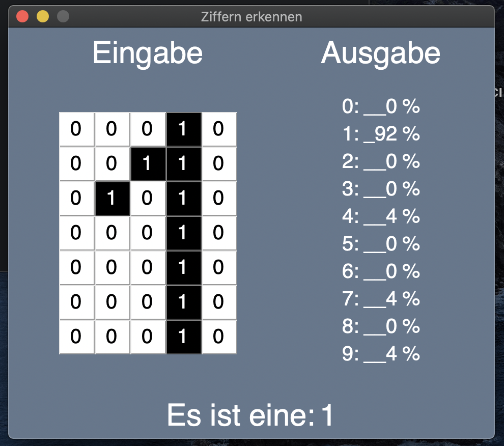

# Aufgabenstellung

Ziel dieses Projektes ist die Entwicklung eines Computerprogramms. Dieses Programm soll in der Lage sein, die arabischen Ziffern von 0 - 9 in einem Pixelraster zu erkennen.

Das Pixelraster ist 7 Pixel hoch und 5 Pixel breit. Ein Pixel besteht aus einer Zahl, die entweder 0 oder 1 ist. 0 bedeutet, der Pixel ist nicht gefüllt oder leer. 1 bedeutet, dieser Pixel ist gefüllt oder ausgemalt. Sollten die Grafiken kleiner sein als das Pixelraster, so werden sie nach Möglichkeit zentriert. In der folgenden Abbildung ist eine beispielhafte Pixelgrafik dargestellt:

{width=20%}

Dazu wird zunächst ein neuronales Netz entwickelt und mit Trainingsdaten mittels Gradientenabstiegsverfahren trainiert. Am Ende gibt es eine interaktive Anwendung, in welche ein beliebiges Pixelmuster eingegeben werden kann. Das Programm nutzt nun das entstandene Netz, um eine der Ziffern in diesem Muster zu erkennen.

{width=40%}
