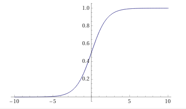

# Lösungsmethode

## Überwachtes Lernen

Das Erkennen von Ziffern ist eine recht komplexe Aufgabe. Sie lässt sich nur sehr schwierig mittels festen Regeln umsetzen. Das liegt nicht zu letzt an einer Vielzahl von Schriftarten und Darstellungsformen für Ziffern. Anstatt ein sehr komplexes und umfangreiches Regelwerk zu entwickeln, wird dieses Projekt mittels **maschinellem Lernen** realisiert. Dazu wird anhand von Beispieldaten vom Computer ein Modell zur Lösung der Aufgabe erstellt. Dabei kommen Algorithmen zum Einsatz, welche in der Lage sind, aus den Beispieldaten die entsprechenden Regeln selbstständig abzuleiten. [vgl. @papp2019, Kap. 6 Machine Learning]

Im Speziellen setzt dieses Projekt auf das **Überwachte Lernen** (engl. Supervised Learning). Das heißt, die Beispieldaten bestehen aus Paaren von Eingabe- und erwarteten Ausgabewerten. Der Algorithmus soll nach dem Training in der Lage sein, die Eingabewerte korrekt auf die erwarteten Ausgaben abzubilden. Dabei soll der Algorithmus gleichzeitig eine **Generalisierung** durchführen. Dadurch sollen auch Eingabewerte richtig verarbeitet werden, die nicht in den Beispieldaten enthalten gewesen sind. [vgl. @papp2019, Kap. 5.2.1 Überwachtes Lernen]

Häufig werden die Beispieldaten in Trainings- und Testdaten unterteilt. Trainingsdaten werden für das Training des Algorithmus verwendet. Die Testdaten werden nach dem Training verwendet. Damit wird überprüft, ob auch noch nicht gesehene Daten richtig zugeordnet werden können. [vgl. @papp2019, Kap. 5.6 Wie gut ist der Algorithmus?]

## Neuronale Netze

Der Algorithmus zur Lösung der Aufgabe ist ein **künstliches neuronales Netz**. Neuronale Netze sind mathematische Konstrukte, welche beliebige Funktionen mithilfe von Beispieldaten approximieren können. Die Erkennung von Ziffern ist eine Funktion, welche Pixelwerte entgegennimmt und die erkannte Ziffer als Ausgabe zurückliefert. [vgl. @sutton2018, Kap. 9.7 Nonlinear Function Approximation: Artificial Neural Networks]

Neuronale Netze sind besonders für die Erkennung von Mustern (vor allem von Ziffern und Buchstaben) geeignet. [vgl. @lammel2020, Kap. 6.3 Typische Anwendungen]

### Biologisches Vorbild

Die Inspiration für neuronale Netze stammt aus dem menschlichen Gehirn. Dieses besteht aus einem Netzwerk von Neuronen. Diese haben nun (z.B. durch äußere Reize) ein elektrisches Aktivierungslevel. Liegt dieses über einem bestimmten Schwellenwert (welcher vom Neuron abhängig ist), ist das Neuron "aktiv". Benachbarte Neuronen sind über Nervenbahnen (Synapsen) miteinander verbunden. Diese Verbindung kann stärker oder auch schwächer sein. Das Aktivierungslevel eines Neurons strahlt dadurch auch auf seine Nachbarn in unterschiedlicher Intensität aus. Durch die unterschiedlichen Stärken der Synapsen und die verschiedenen Verbindungen der Neuronen untereinander entstehen unterschiedlichste Aktivierungsmuster. [vgl. @lammel2020, Kap. 5.1 Das künstliche Neuron]

### Einzelnes Neuron

Ein einzelnes Neuron wird nun mathematisch mit einem sog. **Perzeptron** nachgebildet. Das Perzeptron bekommt eine feste Menge an Eingabewerten. Diese werden mit **Gewichten** versehen, welche die unterschiedlich starken Synapsen darstellen. Die Eingabewerte werden mit den Gewichten multipliziert und anschließend aufsummiert. Hinzu wird ein weiterer Wert addiert – der sog. **Bias**. Dieser stellt den Schwellenwerte zur Aktivierung eines Neurons dar. Zum Schluss wird auf diesen Wert eine **nicht-lineare Aktivierungsfunktion** angewandt (näheres im nächsten Abschnitt). [vgl. @lammel2020, Kap. 5.1 Das künstliche Neuron]

Zusammengefasst ist das Aktivierungslevel bzw. der Output des Neurons wie folgt definiert:

$$
y = \phi(b + \vec w \cdot \vec x)
$$

Wobei $\phi$ die Aktivierungsfunktion, $\vec x$ die Eingabewerte, $\vec w$ die Gewichte und $b$ den Bias darstellt.

### Aktivierungsfunktion

Als **Aktivierungsfunktionen** werden sehr unterschiedliche Funktionen eingesetzt. Je nach Anwendungsfall muss die Funktion verschiedene Anforderungen erfüllen: 

Eine nicht-lineare Aktivierungsfunktion wird eingesetzt, wenn ein Neuron auch nicht lineare Ausgaben liefern können soll. Andernfalls sind die möglichen darstellbaren Funktionen für ein Neuron stark eingeschränkt. [vgl. @sutton2018, Kap. 9.7 Nonlinear Function Approximation: Artificial Neural Networks]

Weiterhin bilden verschiedene Aktivierungsfunktionen ihre Ausgaben in unterschiedlichen Wertebereichen ab. Die Funktion beim klassischen Perzeptron ist bspw. die Schwellenwertfunktion. Diese liefert nur entweder 0 (inaktiv) oder 1 (aktiv) als Ausgabe. [vgl. @lammel2020, Kap. 5.1 Das künstliche Neuron, Absch. Aktivierungsfunktionen]

Eine der populärsten Funktionen in neuronalen Netzen ist die **logistische Funktion**. Sie bildet Werte im Bereich zwischen 0 und 1 ab (inklusive aller reellen Zahlen dazwischen). Die Funktion hat einen sigmoiden (s-förmigen) Charakter. Der große Vorteil dieser Funktion ist, dass sie differenzierbar ist. Dies ist wichtig für das Training. [vgl. @lammel2020, Kap. 5.1 Das künstliche Neuron, Absch. Aktivierungsfunktionen]

{width=50%}

Für dieses Projekt wird daher ausschließlich die **logistische Funktion** und ihre Ableitung verwendet.

\begin{align*}
\phi(x) &= \frac{1}{1+e^{-x}} \\
\phi'(x) &= \phi(x) * (1 - \phi(x))
\end{align*}

### Vorwärtsgerichtete neuronale Netze

Durch die Zusammenschaltung mehrerer Neuronen entsteht nun ein Netz. Sehr geläufig sind hierbei **vorwärtsgerichtete Netze**. Dabei werden mehrere Neuronen zu einer sog. **Schicht** zusammengefasst. Innerhalb einer Schicht besteht keine Verbindung zwischen den Neuronen. Die Schichten werden in einer festen Reihenfolge nacheinander angeordnet. Jedes Neuron einer Schicht wird mit jedem Neuron der Folgeschicht verbunden. Die folgende Abbildung zeigt eine schematische Darstellung eines solchen Netzes:

![Ein vorwärtsgerichtetes Netz mit mehreren Schichten. [Grafik aus @sutton2018]](img/net-with-layers.png){width=60%}

Die weißen Kreise symbolisieren ein Neuron. Dabei sind die Neuronen auf der ersten (linken) Schicht lediglich Input-Neuronen. Diese bekommen also einfach die Inputwerte des Netzes übergeben. Alle Neuronen auf den Folgeschichten sind "echte" Neuronen wie sie zuvor beschrieben worden sind. Diese Werte werden nun über gewichtete Verbindungen (Kanten) an die Folgeschichten weitergeleitet. Die Biaswerte sind in dieser Grafik leider nicht dargestellt. Die nächsten zwei Schichten sind sog. versteckte Schichten und die letzte ist die Ausgabe-Schicht. Das Netz ist also in der Lage einen Vektor an Eingabewerten zu verarbeiten und auch einen Vektor an Ausgabewerten zurückzugeben. [vgl. @sutton2018, Kap. 9.7 Nonlinear Function Approximation: Artificial Neural Networks]

Die Berechnung des Ausgabe-Vektors einer Schicht setzt sich also aus den einzelnen Berechnungen für jedes einzelne Neuron zusammen. Da die Neuronen auf einer Schicht nicht miteinander verbunden sind, kann die Berechnung mit Vektoren und Matrizen umgesetzt werden. Die Mathematik dahinter ist dadurch recht elegant. Anstatt die Gewichte und den Bias für jedes Neuron separat zu speichern, kann eine Matrix $W$ für die Gewichte und ein Vektor $\vec b$ für die Biaswerte jedes Neurons verwendet werden. Die Gewichtsmatrix enthält die Gewichte zwischen den Neuronen der Schichten. Eine Spalte ist dabei dem Neuron auf der vorherigen, eine Zeile dem Neuron der Folgeschicht zugeordnet. Dadurch lässt sich die Ausgabe einer einzelnen Schicht wiefolgt berechnen:

$$
\vec y = \phi(\vec b + W \cdot \vec x)
$$

Zu beachten ist dabei, dass die Aktivierungsfunktion $\phi$ einen Vektor als Parameter übergeben bekommt. Sie verhält sich nun so, dass auf jeden Wert im Vektor die Funktion einzeln angewandt wird. Für jedes Element im Eingabevektor wird ein entsprechendes Wert im Ausgabevektor $\vec y$ berechnet.

### Topologie des Netzes

Da Pixelgrafiken mit 7 x 5 Pixeln analysiert werden sollen, muss die *Eingabeschicht* des Netzes über *35 Neuronen* verfügen.

Es gibt 10 Ziffern (von 0 bis 9), die erkannt werden können. Auf der *Ausgabeschicht* wird es also *10 Neuronen* geben. Jedes symbolisiert eine der Ziffern. Das Ausgabeneuron mit dem höchsten Wert ist die jeweils erkannte Ziffer.

Eine versteckte Schicht ist vollkommen ausreichend, damit ein neuronales Netz jede beliebige Funktion darstellen kann. Zumindest wenn nicht-lineare Aktivierungsfunktionen verwendet werden [vgl. @sutton2018, Kap. 9.7 Nonlinear Function Approximation: Artificial Neural Networks]. Daher wird in diesem Projekt auch nur mit *einer versteckten Schicht* gearbeitet.

Für die Anzahl der Neuronen auf der versteckten Schicht gibt es kein Patentrezept. Je mehr Neuronen es sind, desto genauer kann die Zielfunktion gelernt werden. Allerdings werden die Berechnungen aufwendiger. Gleichzeitig sinkt die Fähigkeit des Netzes, Generalisierungen vorzunehmen. Man spricht hier vom sog. **Overfitting**. Das Netz "lernt" eher die Beispieldaten auswendig, als den dahinterliegenden Algorithmus zu finden [vgl. @lammel2020, Kap. 6.5.1 Die Größe der inneren Schicht]. Für dieses Projekt wird daher folgendes Vorgehen angewandt: Es werden verschiedene Netze mit verschiedenen Neuronenzahlen auf der versteckten Schicht generiert. Die Netze, welche direkt einen sehr kleinen Fehler über die Beispieldaten aufweisen, werden für ein paar Epochen (näheres in den folgenden Abschnitten) trainiert. Anschließend wird analysiert, wie schnell sich das jeweilige Netz trainieren lässt und wie gut es generalisiert. Das Netz, welches hier die besten Ergebnisse zeigt, wird dann für das weitere Training verwendet.

Aus der beschriebenen Topologie ergibt sich die folgende Formell zur Berechnung der Ausgabe $\vec y$ des gesamten Netzes für die Eingabe $\vec x$:

$$
\vec y = \phi(\vec b_o + W_o \cdot \phi(\vec b_h + W_h \cdot \vec x))
$$

Die Bezeichner geben die jeweilige Schicht an, zu welcher ein Wert gehört. $\vec b_o$ sind also bspw. die *Biaswerte* auf der *Output-Schicht* oder $W_h$ bezeichnet die *Gewichtsmatrix* der versteckten Schicht (von engl. *hidden layer*).

## Gradientenabstiegsverfahren

Nun stellt sich die Frage, wie das neuronale Netz die gesuchte Funktion approximiert bzw. wie überhaupt das Training durchgeführt wird. Die Gewichte und Biaswerte der versteckten und der Output-Schicht müssen richtig eingestellt werden, damit das Netz die Ziffernerkennung durchführen kann. Eines der gängigsten Lernverfahren für diese Aufgabe ist das **Gradientenabstiegsverfahren**. [vgl. @lammel2020, Kap. 6.2.1 Das Backpropagation-Verfahren]

### Grundprinzip

Gradientenabstiegsverfahren werden verwendet, um das Minimum einer Funktion zu finden. Man beginnt an einem zufälligen Punkt auf der Funktion. Nun wird der *Anstieg* (auch Gradient genannt) in diesem Punkt berechnet. Da ein Minimum der kleinste mögliche Wert einer Funktion ist, bewegt man sich nun entgegengesetzt des Anstiegs entlang der Funktion. Je stärker der Anstieg, umso größer fällt auch der Schritt in die entgegengesetzte Richtung aus. [vgl. @lammel2020, Kap. 6.2.1 Das Backpropagation-Verfahren]

![Das Newton-Verfahren als der Ursprung des Gradientenabstiegsverfahren. [Grafik aus @lammel2020]](img/gradientenabstieg.png){width=40%}

Mit diesem Verfahren geschieht aber nur eine Annäherung an das Minimum. Die Idee ist, dass man dieses Vorgehen mehrmals hintereinander durchführt, bis das Minimum der Funktion gefunden ist. [vgl. @lammel2020, Kap. 6.2.1 Das Backpropagation-Verfahren]

### Fehlerfunktion

Das neuronale Netz muss nun also so dargestellt werden, dass die Gewichte und Biaswerte als Parameter für eine Funktion dienen. Gleichzeitig muss diese Funktion ein Minimum haben, welches gleichzeitig bei der Lösung der Aufgabe hilft. Die Lösung: man definiert eine sog. **Fehlerfunktion**, welche die Abweichung zwischen den berechneten Ausgaben des neuronalen Netzes und den erwarteten Ausgabewerten aus den Beispieldaten bestimmt. Die verschiedenen Fehlerwerte zwischen den berechneten und den erwarteten Ausgabewerten werden in einen einzelnen Fehlerwert komprimiert. Da die Ausgabe des Netzes einzig von den Gewichten und Biaswerten beeinflusst wird, kann durch die Anpassung der selbigen die Differenz und damit der Fehler *minimiert* werden. [vgl. @lammel2020, Kap. 6.2.1 Das Backpropagation-Verfahren; und @patterson2017, Kap. 2 Foundations of Neural Networks and Deep Learning, Absch. Loss Functions]

Auch für die Fehlerfunktion gibt es eine große Fülle an Möglichkeiten. Eine der universellsten ist die **Mean Squared Error** Funktion (zu deutsch: die Funktion der durchschnittlichen Fehlerquadrate). Diese Funktion bietet mehrere Vorteile: Zum Einen sind die Differenzen nicht vorzeichenbehaftet. Dadurch heben sich zwei fehlerhafte Neuronen mit entgegengesetzten Fehlerwerten nicht gegenseitig auf. Zum Anderen sind die Fehlerwerte für große Abweichungen sehr groß, kleinere Abweichung werden hingegen weniger stark gewichtet. Dadurch ist die Gefahr des Overfitting geringer und das Netz neigt zu einer besseren Generalisierung. Zu guter Letzt sei erwähnt, dass diese Funktion gut differenzierbar ist. [vgl. @patterson2017, Kap. 2 Foundations of Neural Networks and Deep Learning, Absch. Loss Functions]

\begin{align*}
E(\vec y, \vec\hat y) &= \frac{1}{n} \cdot \sum (y_i - \hat y_i)^2 \\
E'_i(\vec y, \vec\hat y) &= \frac{2}{n} \cdot (y_i - \hat y_i)
\end{align*}

Die Ableitung der Mean Squared Error Funktion ist hier nur für das i-te Ausgabeneuron dargestellt. Natürlich wird sie auf alle Ausgabeneuronen angewendet, sodass man einen Gradienten für jedes der Ausgabeneuronen erhält.

### Anwendung im neuronalen Netz

Man beginnt mit zufälligen Werten für die Gewichte und Bias. Als nächstes wird der Gradient $\Delta$ zu jedem veränderbaren Parameter ermittelt. Anschließend wird dieser Gradient mit einer **Lernrate** $\lambda$ multipliziert. Das Ergebnis wird nun vom ursprünglichen Wert abgezogen. [vgl. @lammel2020, Kap. 6.2.1 Das Backpropagation-Verfahren]

$$
W_{neu} = W_{alt} - \lambda \cdot \Delta
$$

Wie bereits erwähnt, nähert man sich mit einem Trainingsdurchlauf dem Minimum der Fehlerfunktion lediglich an. Um tatsächlich ein Minimum zu erreichen, müssen viele solcher Durchläufe hintereinander durchgeführt werden. Ein solcher Trainingsdurchlauf über das gesamte Set an Trainingsdaten wird auch als **Epoche** bezeichnet. [vgl. @patterson2017, Kap. 6 Tuning Deep Networks, Absch. Controlling Epochs and Mini-Batch Size]

Da es verschiedene Gewichte und Biaswerte auf den verschiedenen Schichten gibt, muss die Fehlerfunktion stets nach dem jeweiligen Wert abgeleitet werden. Daher ergeben sich folgende Gleichung für die Gradienten:

\begin{align*}
\Delta \vec  b_o = \frac{\delta E}{\delta \vec b_o} &= E'(\vec y, \vec \hat y) \cdot \phi'(\vec b_o + W_o \cdot \vec x_h) \\
\Delta W_o = \frac{\delta E}{\delta W_o} &= E'(\vec y, \vec \hat y) \cdot \phi'(\vec b_o + W_o \cdot \vec x_h) \cdot \vec x_h^T \\ \\
\Delta \vec  b_h = \frac{\delta E}{\delta \vec b_h} &= E'(\vec y, \vec \hat y) \cdot \phi'(\vec b_o + W_o \cdot \vec x_h) \cdot W_o^T \cdot \phi'(\vec b_h + W_h \cdot \vec x) \\
\Delta W_h = \frac{\delta E}{\delta W_h} &= E'(\vec y, \vec \hat y) \cdot \phi'(\vec b_o + W_o \cdot \vec x_h) \cdot W_o^T \cdot \phi'(\vec b_h + W_h \cdot \vec x) \cdot \vec x^T
\end{align*}

Die Netzausgabe ist eine stark in sich verschachtelte Funktion. Daher muss hier exzessiv von der Kettenregel Gebrauch gemacht werden. Bei $\vec x_h$ handelt es sich um den Ausgabevektor der versteckten Schicht, welcher ja gleichzeitig der Eingabevektor für die Output-Schicht ist.

Mit den Gradienten können nun die Gewichte und Biaswerte im gesamten Netz angepasst werden. Da man hier praktisch zuerst eine Berechnung über das Netz durchführt und dann nachträglich die Parameter korrigiert, wird dieses Verfahren auch als **Backpropagation** bezeichnet. [vgl. @lammel2020, Kap. 6.2.1 Das Backpropagation-Verfahren]

### Lernrate

Die Annäherung an das Minimum der Fehlerfunktion erfolgt über viele Epochen. Dieses Verfahren ist aber alles andere als präzise. Würde der Gradient voll von den Gewichten und Biaswerten abgezogen werden, so würden die Korrekturen recht stark ausfallen. Im schlimmsten Fall "springt" der Fehler mit jedem Training um das Minimum herum, erreicht es aber nicht, da die Korrekturen zu groß sind. Daher wird der Gradient mit einer Lernrate zwischen 0 und 1 multipliziert. Dadurch ist die Korrektur wesentlich feiner und die Chancen stehen besser, tatsächlich genau das Minimum zu treffen. Allerdings fallen dadurch die Korrekturen insgesamt viel kleiner aus und es sind viel mehr Epochen nötig als ohne Lernrate. [vgl. @patterson2017, Kap. 2 Foundations of Neural Networks and Deep Learning, Absch. Learning Rate]

Es muss also ein Gleichgewicht gefunden werden. Die Lernrate muss groß genug sein, damit das Training nicht ewig dauert. Gleichzeitig darf sie nicht zu groß sein, damit eine möglichst präzise Annäherung an das Minimum möglich ist. Dies ist kein leichtes Unterfangen, zumal die Lernrate fast der wichtigste Hyperparameter beim Training neuronaler Netz ist. [vgl. @patterson2017, Kap. 6 Tuning Deep Networks, Absch. Understanding Learning Rates]

Es existieren sehr vielfältige Ansätze zur Lösung dieses Problems: Einige Verfahren versuchen mit einer möglichst hohen Lernrate zu beginnen und diese im Verlaufe des Trainings geschickt zu reduzieren. Andere Optimierungen berechnen spezielle Lernraten für jedes der Neuronen einzeln. Der bekannteste und wohl erfolgreichste Algorithmus in diesem Zusammenhang ist *Adam*. [vgl. @kingma2014; und @patterson2017, Kap. 6 Tuning Deep Networks, Absch. Understanding Learning Rates]

Diese Verfahren sind recht komplex zu implementieren und der Erfolg ist nicht Gewiss. Außerdem ist der Umfang an Beispieldaten und die Netzgröße für dieses Projekt überschaubar klein. Daher wird das Training ausschließlich mit einer *konstanten Lernrate* durchgeführt werden. Dennoch werden zunächst verschiedene Lernraten über ein paar Epochen getestet und anschließend der optimale Wert bestimmt.

### Batch-Learning

Eine letzte Optimierung, die beim Training zum Einsatz kommen wird, ist das **Batch-Learning**.

Die Beispieldaten umfassen mehrere verschiedene Grafiken mit unterschiedlichen Ziffern. Da das Netz alle diese Ziffern erkennen soll, müsste nacheinander stets eine andere Ziffer für das Training verwendet werden. Sobald man mit dem Set durch ist, beginnt man wieder von vorne. Dabei kann es passieren, dass zwei Ziffern genau gegensätzliche Gradienten erzeugen und sich die Korrekturen im Kreis drehen. Dadurch dauert das Training sehr lange.

Das Batch-Learning verbessert diesen Prozess. Dabei werden mit dem gleichen Netz die Gradienten für mehrere Datensätze gleichzeitig berechnet. Aus den verschiedenen Gradienten wird nun der Durchschnitt gebildet. Dieser wird anschließend mit der Lernrate multipliziert und von den Gewichten abgezogen. Dadurch wird mit einem Trainingsschritt ein ganzes Set an Daten angelernt. [vgl. @patterson2017, Kap. 2 Foundations of Neural Networks and Deep Learning, Abs. Backpropagation and Mini-Batch Stochastic Gradienten Descent]
