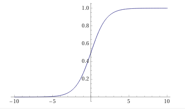

# Lösungsmethode

## Überwachtes Lernen

Das Erkennen von Ziffern ist eine recht komplexe Aufgabe. Sie lässt sich nur sehr schwierig mittels festen Regeln umsetzen. Das liegt nicht zu letzt an einer Vielzahl von Schriftarten und Darstellungsformen für Ziffern. Anstatt ein sehr komplexes und umfangreiches Regelwerk zu entwickeln, wird dieses Projekt mittels **maschinellem Lernen** realisiert. Dazu wird anhand von Beispieldaten vom Computer ein Modell zur Lösung der Aufgabe erstellt. Dabei kommen Algorithmen zum Einsatz, welche in der Lage sind, aus den Beispieldaten die entsprechenden Regeln selbstständig abzuleiten. [vgl. @papp2019, Kap. 6 Machine Learning]

Im Speziellen setzt dieses Projekt auf das **Überwachte Lernen** (engl. Supervised Learning). Das heißt, die Beispieldaten bestehen aus Paaren von Eingabe- und erwarteten Ausgabewerten. Der Algorithmus soll nach dem Training in der Lage sein, die Eingabewerte korrekt auf die erwarteten Ausgaben abzubilden. Dabei soll der Algorithmus gleichzeitig eine Verallgemeinerung durchführen. Dadurch sollen auch Eingabewerte richtig verarbeitet werden, die nicht in den Beispieldaten enthalten gewesen sind. [vgl. @papp2019, Kap. 5.2.1 Überwachtes Lernen]

Häufig werden die Beispieldaten in Trainings- und Testdaten unterteilt. Trainingsdaten werden für das Training des Algorithmus verwendet. Die Testdaten werden nach dem Training verwendet. Damit wird überprüft, ob auch noch nicht gesehene Daten richtig zugeordnet werden können. [vgl. @papp2019, Kap. 5.6 Wie gut ist der Algorithmus?]

## Neuronale Netze

Der Algorithmus zur Lösung der Aufgabe ist ein **künstliches neuronales Netz**. Neuronale Netze sind mathematische Konstrukte, welche beliebige Funktionen mithilfe von Beispieldaten approximieren können. Die Erkennung von Ziffern ist eben eine Funktion, welche Pixelwerte entgegennimmt und die erkannte Ziffer als Ausgabe zurückliefert. [vgl. @sutton2018, Kap. 9.7 Nonlinear Function Approximation: Artificial Neural Networks]

Neuronale Netze sind besonders für die Erkennung von Mustern (vor allem von Ziffern und Buchstaben) geeignet. [vgl. @lammel2020, Kap. 6.3 Typische Anwendungen]

### Biologisches Vorbild

Die Inspiration für neuronale Netze stammt aus dem menschlichen Gehirn. Dieses besteht aus einem Netzwerk von Neuronen. Diese haben nun (z.B. durch äußere Reize) ein elektrisches Aktivierungslevel. Liegt dieses über einem bestimmten Schwellenwert (welcher vom Neuron abhängig ist), ist das Neuron "aktiv". Benachbarte Neuronen sind über Nervenbahnen (Synapsen) miteinander verbunden. Diese Verbindung kann stärker oder auch schwächer sein. Das Aktivierungslevel eines Neurons strahlt dadurch auch auf seine Nachbarn in unterschiedlicher Intensität aus. Durch die unterschiedlichen Stärken der Synapsen und die verschiedenen Verbindungen der Neuronen untereinander entstehen unterschiedlichste Aktivierungsmuster. [vgl. @lammel2020, Kap. 5.1 Das künstliche Neuron]

### Einzelnes Neuron

Ein einzelnes Neuron wird nun mathematisch mit einem sog. Perzeptron nachgebildet. Das Perzeptron bekommt eine feste Menge an Eingabewerten. Diese werden mit Gewichten versehen, welche die unterschiedlich starken Synapsen darstellen. Die Eingabewerte werden mit den Gewichten multipliziert und anschließend aufsummiert. Hinzu wird ein weiterer Wert addiert – der sog. Bias. Dieser stellt den Schwellenwerte zur Aktivierung eines Neurons dar. Zum Schluss wird auf diesen Wert eine nicht-lineare Aktivierungsfunktion angewandt (näheres im nächsten Abschnitt). [vgl. @lammel2020, Kap. 5.1 Das künstliche Neuron]

Zusammengefasst ist das Aktivierungslevel bzw. der Output des Neurons wie folgt definiert:

$$
y = \phi(\vec w \cdot \vec x + b)
$$

Wobei $\phi$ die Aktivierungsfunktion, $\vec x$ die Eingabewerte (input), $\vec w$ die Gewichte und $b$ den Bias darstellt.

### Aktivierungsfunktion

Als Aktivierungsfunktionen werden sehr unterschiedliche Funktionen eingesetzt. Je nach Anwendungsfall muss die Funktion verschiedene Anforderungen erfüllen: 

Eine nicht-lineare Aktivierungsfunktion wird eingesetzt, wenn ein Neuron auch nicht lineare Ausgaben liefern können soll. Andernfalls sind die möglichen darstellbaren Funktionen für ein Neuron stark eingeschränkt. [vgl. @sutton2018, Kap. 9.7 Nonlinear Function Approximation: Artificial Neural Networks]

Weiterhin bilden verschiedene Aktivierungsfunktionen ihre Ausgaben in unterschiedlichen Wertebereichen ab. Die Funktion beim klassischen Perzeptron ist bspw. die Schwellenwertfunktion. Diese liefert nur entweder 0 (inaktiv) oder 1 (aktiv) als Ausgabe. [vgl. @lammel2020, Kap. 5.1 Das künstliche Neuron, Absch. Aktivierungsfunktionen]

Eine der populärsten Funktionen in neuronalen Netzen ist die **logistische Funktion**. Sie bildet Werte im Bereich zwischen 0 und 1 ab (inklusive aller reellen Zahlen dazwischen). Die Funktion hat einen sigmoiden (s-förmigen) Charakter. Der große Vorteil dieser Funktion ist, dass sie differenzierbar ist. Dies ist wichtig für das Training. [vgl. @lammel2020, Kap. 5.1 Das künstliche Neuron, Absch. Aktivierungsfunktionen]

{width=60%}

Für dieses Projekt wird daher ausschließlich die **logistische Funktion** und ihre Ableitung verwendet.

\begin{align*}
sig(x) &= \frac{1}{1+e^{-x}} \\
sig'(x) &= sig(x) * (1 - sig(x))
\end{align*}

### Vorwärtsgerichtete neuronale Netze

Durch die Zusammenschaltung mehrerer Neuronen entsteht nun ein Netz. Sehr geläufig sind hierbei **vorwärtsgerichtete Netze**. Dabei werden mehrere Neuronen zu einer sog. Schicht zusammengefasst. Innerhalb einer Schicht besteht keine Verbindung zwischen den Neuronen. Die Schichten werden in einer festen Reihenfolge nacheinander angeordnet. Jedes Neuron einer Schicht wird mit jedem Neuron der Folgeschicht verbunden. Die folgende Abbildung zeigt eine schematische Darstellung eines solchen Netzes:

![Ein vorwärtsgerichtetes Netz mit mehreren Schichten. Grafik aus [@sutton2018]](img/net-with-layers.png){width=90%}

Die weißen Kreise symbolisieren ein Neuron. Dabei sind die Neuronen auf der ersten (linken) Schicht lediglich Input-Neuronen. Diese bekommen also einfach die Inputwerte des Netzes übergeben. Alle Neuronen auf den Folgeschichten sind "echte" Neuronen wie sie zuvor beschrieben worden sind. Diese Werte werden nun über gewichtete Verbindungen (Kanten) an die Folgeschichten weitergeleitet. Die nächsten zwei Schichten sind sog. versteckte Schichten und die letzte ist die Ausgabe-Schicht. Das Netz ist also in der Lage einen Vektor an Eingabewerten zu verarbeiten und auch einen Vektor an Ausgabewerten zurückzugeben. [vgl. @sutton2018, Kap. 9.7 Nonlinear Function Approximation: Artificial Neural Networks]

Die Berechnung des Ausgabe-Vektors einer Schicht setzt sich also aus den einzelnen Berechnungen für jedes einzelne Neuron zusammen. Da die Neuronen auf einer Schicht nicht miteinander verbunden sind, kann die Berechnung mit Vektoren und Matrizen umgesetzt werden. Die Mathematik dahinter ist dadurch recht elegant. Anstatt die Gewichte und den Bias für jedes Neuron separat zu speichern, kann eine Matrix $W$ für die Gewichte und ein Vektor $\vec b$ für die Biaswerte jedes Neurons verwendet werden. Die Gewichtsmatrix enthält die Gewichte zwischen den Neuronen der Schichten. Eine Spalte ist dabei dem Neuron auf der vorherigen, eine Zeile dem Neuron der Folgeschicht zugeordnet. Dadurch lässt sich die Ausgabe einer einzelnen Schicht wiefolgt berechnen:

$$
\vec y = sig(\vec b + W * \vec x)
$$

$\vec x$ sind die Eingabewerte und $sig()$ ist die sigmoide Aktivierungsfunktion. Zu beachten ist dabei, dass die Aktivierungsfunktion auf jeden Wert im Vektor einzeln angewandt wird. Die Ausgabe $\vec y$ ist also ebenfalls ein Vektor.

### Topologie des Netzes

Da Pixelgrafiken mit 7 x 5 Pixeln analysiert werden sollen, muss die *Eingabeschicht* des Netzes über *35 Neuronen* verfügen.

Es gibt 10 Ziffern (von 0 bis 9), die erkannt werden können. Auf der *Ausgabeschicht* wird es also *10 Neuronen* geben. Jedes symbolisiert eine der Ziffern. Das Ausgabeneuron mit dem höchsten Wert ist die jeweils erkannte Ziffer.

Eine versteckte Schicht ist vollkommen ausreichend, damit ein neuronales Netz jede beliebige Funktion darstellen kann. Zumindest wenn nicht-lineare Aktivierungsfunktionen verwendet werden [vgl. @sutton2018, Kap. 9.7 Nonlinear Function Approximation: Artificial Neural Networks]. Daher wird in diesem Projekt auch nur mit *einer versteckten Schicht* gearbeitet.

Für die Anzahl der Neuronen auf der versteckten Schicht gibt es kein Patentrezept. Je mehr Neuronen es sind, desto genauer kann die Zielfunktion gelernt werden. Allerdings werden die Berechnungen aufwendiger. Gleichzeitig sinkt die Fähigkeit des Netzes, Generalisierungen vorzunehmen [vgl. @lammel2020, Kap. 6.5.1 Die Größe der inneren Schicht]. Für dieses Projekt wird daher ein stark vereinfachtes Vorgehen genutzt werden: zunächst werden verschiedene Netze mit verschiedene Anzahlen von Neuronen auf der versteckten Schicht generiert. Das Netz, welches direkt den kleinsten Fehler aufweist, wird weiterverwendet.

Daraus folgt, dass die Berechnung der Ausgabe $\vec y$ des gesamten Netzes für die Eingabe $\vec i$ wiefolgt lautet:

$$
\vec y = sig(\vec b_o + W_o * sig(\vec b_h + W_h * \vec x))
$$

Die Bezeichner geben die jeweilige Schicht zu welcher ein Wert gehört. $\vec b_o$ sind also bspw. die Bias-Werte auf der Output-Schicht oder $W_h$ bezeichnet die Gewichtsmatrix der versteckten Schicht (von engl. *hidden layer*).

## Gradientenabstiegsverfahren

- NN sind parametrisierbar über die Gewichte und Bias auf den verschiedenen Schichten
- Um optimale Parameter zu finden, können verschiedeneste Lernfahren verwendet werden.
- gängistes: Gradientenabstiegsverfahren

### Grundprinzip

- Minimum einer Funktion gesucht
- Annäherung durch Bewegung entgegen des Gradienten (Anstieg)

### Fehlerfunktion

- Fehlerfunktion um Abweichung zwischen berechnetem und erwartetem Output darzustellen
  - => je höher, desto schlechter
- Minimum der Funktion gesucht
- positive und negative Abweichungen sollten sich nicht ausgleichen
- sehr geläufig: Mean Squared Error
- Vorteil: Vorzeichen der Differenzen spielen keine Rolle, gut differenzierbar

$$
E(\vec y, \vec z) = \frac{1}{n} * \sum (y_i - z_i)^2
$$

$$
E'_i(\vec y, \vec z) = \frac{2}{n} * (y_i - z_i)
$$

### Anwendung im neuronalen Netz

$$
W_{neu} = W_{alt} - \lambda \cdot \Delta W
$$

\begin{align*}
\delta b_o &= mse'(\vec y, \vec z) * sig'(\vec b_o + W_o * \vec x_h) \\
\delta W_o &= mse'(\vec y, \vec z) * sig'(\vec b_o + W_o * \vec x_h) *  \vec h^T \\ \\
\delta b_h &= mse'(\vec y, \vec z) * sig'(\vec b_o + W_o * \vec x_h) * W_o^T * sig'(\vec b_h + W_h * \vec x) \\
\delta W_h &= mse'(\vec y, \vec z) * sig'(\vec b_o + W_o * \vec x_h) * W_o^T * sig'(\vec b_h + W_h * \vec x) * \vec x^T
\end{align*}

### Batch-Learning

- Da ganzes Set von Trainingsdaten vorhanden => ganzes Set zum Lernen verwenden
- Berechnung Gradienten zu jedem Trainingsdatensatz
- Durchschnitt von allen Gradienten bilden und abziehen
