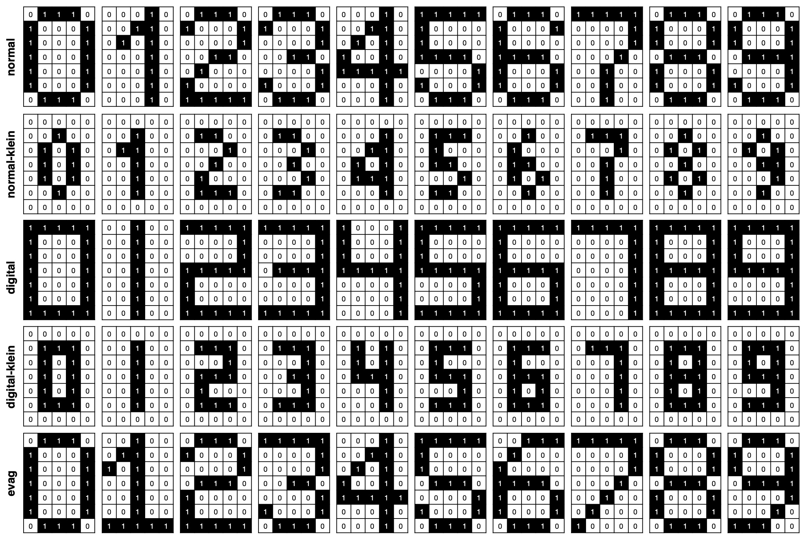

# Simulation (Quelltext)

ablauf main.py

...

## Trainings- und Testdaten

- Traingsdaten => Sets von 0-9: normal, klein, digital, digital-klein
- Testdaten => evag

### Ermittlung der Neuronenzahl auf der versteckten Schicht

- Generierung verschiedener Netze
- jeweils 100 Netze mit der gleichen Topologie
- Netz mit geringstem Fehler wird behalten
- Vergleich der Netze mit unterschiedlicher Topologie
- Topologie mit geringstem Fehler wird gewählt

## Trainingsprozess

### Backpropagation

Vereinfacht:

\begin{align*}
\delta b_o &= mse'(\vec o, \vec t) \cdot sig'(\vec b_o + W_o \cdot \vec h) \\
\delta W_o &= \delta b_o \cdot \vec h^T \\ \\
\delta b_h &= \delta b_o \cdot W_o^T \cdot sig'(\vec b_h + W_h * \vec i) \\
\delta W_h &= \delta b_h \cdot \vec i^T
\end{align*}

### Lernrate

...

## Interaktives Ergebnis-Programm

- zuerst Erstellung und Training des Netzes (separates Skript)
- finales Netz wird gespeichert
- kleines GUI Programm => lädt Netz
- über GUI können Pixelgrafiken erstellt werden
- Netz berechnet erkannte Ziffer => wird angezeigt
