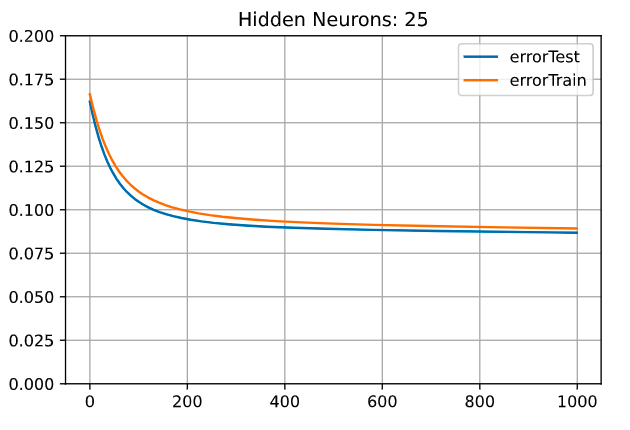
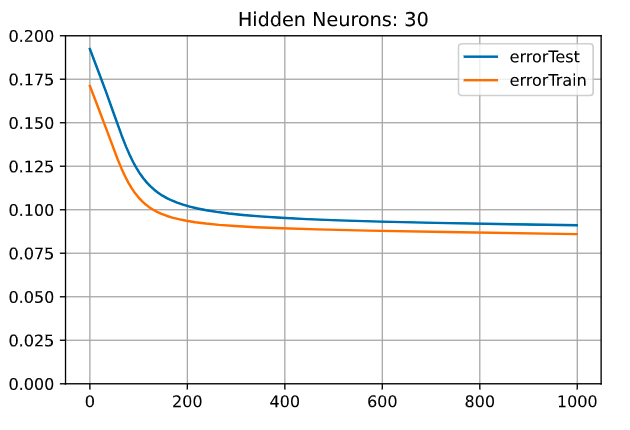
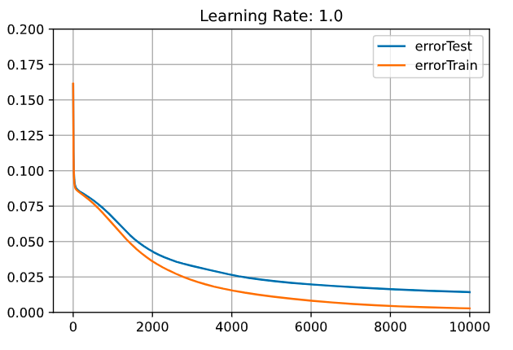
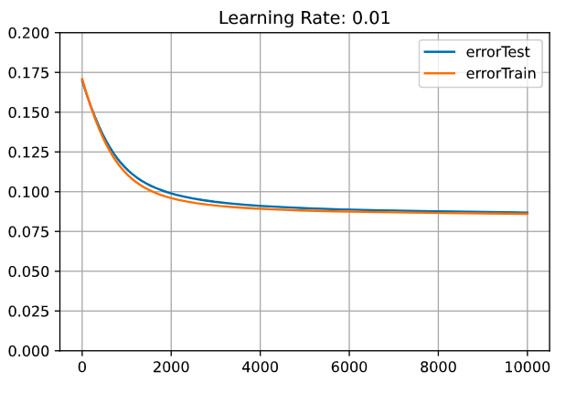
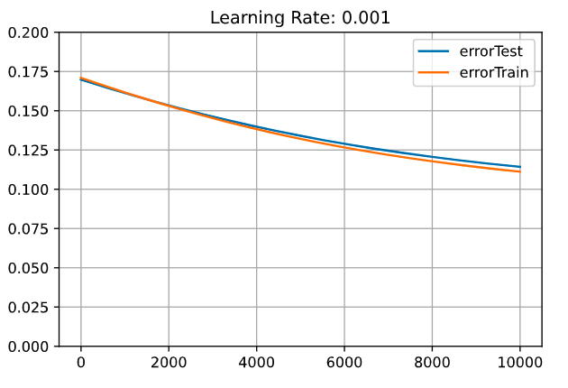
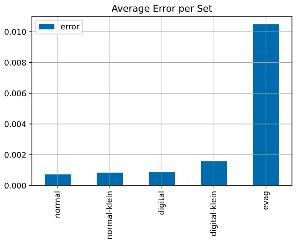
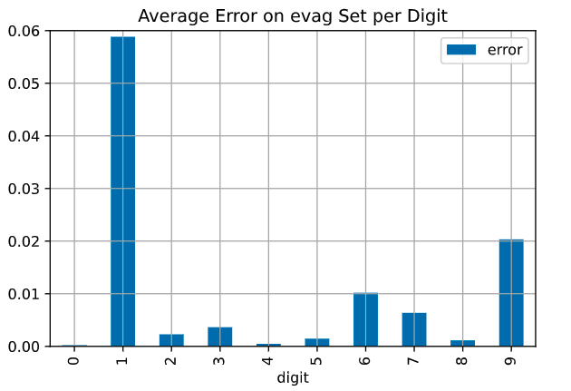

# Ergebnisse

## Ermittlung der Neuronenzahl auf der versteckten Schicht

### Geringster initialer Fehler

Wie bereits beschrieben, sind zunächst jeweils 100 Netze pro Neuronenzahl auf der versteckten Schicht zufällig generiert worden. Anschließend wurde der Fehler über alle Beispieldaten berechnet. Die folgende Grafik zeigt die Ergebnisse:

{width=60%}

Es ist deutlich zu sehen, dass die Fehler aller Netze ziemlich gleichmäßig verteilt sind. Ab 40 Neuronen auf der versteckten Schicht werden die Fehler aber tendenziell eher höher. Das ist ein Zeichen, dass die optimale Neuronenzahl eher unter 40 liegt. Allerdings gibt es hier eine Ausnahme: Einige Netze mit 70 Neuronen haben ebenfalls sehr geringe Fehlerwerte.

Für die Lösung der Aufgabe sind nur Netze mit geringen Fehlerwerten von Belang. Daher zeigt die folgende Tabelle zu jeder Neuronenzahl das Netz mit dem geringsten Fehler. Die Werte sind außerdem vom geringsten zum größten Fehler sortiert worden.

| Neuronenzahl | Fehlerwert des besten Netzes
|:-:|:-:|
| 35 | 0,1435 |
| 70 | 0,1437 |
| 20 | 0,1629 |
| 25 | 0,1667 |
| 15 | 0,1707 |
| 30 | 0,1760 |
| 5  | 0,1830 |
| 10 | 0,1878 |
| 60 | 0,1885 |
| 40 | 0,1904 |
| 50 | 0,2071 |
| 90 | 0,2121 |
| 80 | 0,2391 |

Die Tabelle bestätigt die erste Beobachtung: Netze mit 40 Neuronen oder mehr haben einen sehr hohen Fehler. Zusätzlich ist zu sehen, dass die Netze mit 5 und 10 Neuronen ebenfalls einen etwas höheren Fehler aufweisen. Die optimale Neuronenzahl scheint also eher zwischen 15 und 35 Neuronen zu liegen. Einzige Ausnahme ist der Ausreißer mit 70 Neuronen, welcher den 2. Platz belegt.

### Fehlerwerte im Verlauf des Trainings

Nun soll überprüft werden, wie schnell die jeweiligen Netze lernen können. Auch ihre Fähigkeit zur Generalisierung wird nun auf die Probe gestellt.

Wie bereits beschrieben, sind die Netze mit den kleinsten Fehlerwerten für 1.000 Epochen mit einer Lernrate von 0,1 trainiert worden. Allerdings sind direkt die Erkenntnisse aus der ersten Betrachtung hier eingeflossen: Es sind nur die Netze mit Neuronenzahlen von 15 bis 35 und zusätzlich das 70er Netz trainiert worden. Die folgende Tabelle zeigt den Lernerfolg der verschiedenen Netze:

| Neuronenzahl | Fehlerwert zu Beginn | Fehlerwert nach dem Training | Differenz
|:-:|:-:|:-:|:-:|
| 30 | 0,1760 | 0,0860 | 0,0900 |
| 15 | 0,1707 | 0,0860 | 0,0846 |
| 25 | 0,1667 | 0,0892 | 0,0775 |
| 20 | 0,1629 | 0,0912 | 0,0717 |
| 35 | 0,1435 | 0,0840 | 0,0595 |
| 70 | 0,1437 | 0,0885 | 0,0551 |

Die Werte sind absteigend nach der Spalte "Differenz" sortiert. Diese Spalte gibt an, wie stark sich der Fehlerwert durch das Training verbessert hat.

Interessanterweise haben die beiden Netze, welche zu Beginn den geringsten Fehlerwert hatten (35 und 70), einen sehr geringen Trainingserfolg zu verbuchen. Sie haben einfach zu viele Neuronen auf der versteckten Schicht und lassen sich dadurch schlechter trainieren. Damit scheiden sie als Kandidaten ebenfalls aus.

### Fähigkeit zur Generalisierung

Es verbleiben 4 Netze mit 15, 20, 25 und 30 Neuronen auf der versteckten Schicht. Um hier eine Entscheidung zu treffen, werden die Verläufe der Fehlerwerte von den Trainings- und den Testdaten nun analysiert:

{width=50%}
{width=50%}
{width=50%}
{width=50%}

Die blaue Linie zeigt den Verlauf der Fehlerwerte der Trainingsdaten. Die orangene zeigt den Verlauf für die Testdaten.

Die Fehlerwerte der Netze entwickeln sich ziemlich gleichmäßig. Allerdings fällt auf, dass die Fehlerwerte der Trainings- und Testdaten umso weiter auseinanderliegen, je höher die Neuronenzahl auf der versteckten Schicht ist. Dies lässt sich mit der theoretischen Grundlage gut erklären: Je weniger Neuronen sich auf der versteckten Schicht befinden, desto eher muss das Netz generalisieren, um die korrekten Ausgaben zu erzeugen (siehe Kapitel 2).

Damit ist die optimale Anzahl an Neuronen für die versteckte Schicht gefunden: Mit **15 Neuronen** können die Ergebnisse zuverlässig und schnell gelernt werden. Gleichzeitig führt das Netz ein hohes Maß an Generalisierung durch und kommt so mit einer Vielzahl von Eingabewerte zurecht.

## Ermittlung der optimalen Lernrate

Als nächstes gilt es, die optimale Lernrate zu finden. Dazu sind alle durchgeführten Trainingsepochen wieder verworfen worden. Das Netz besitzt also wieder die initial generierten Werte. Es ist nun mit 4 unterschiedlichen Lernraten für 10.000 Epochen trainiert worden. Die Lernraten sind: 1; 0,1; 0,01 und 0,001. Die folgenden Grafiken zeigen die Ergebnisse:

{width=50%}
{width=50%}
{width=50%}
{width=50%}

Alle vier Grafiken zeigen einen identischen Verlauf der Fehlerwerte. Einziger Unterschied: je niedriger die Lernrate, desto länger zieht sich das Training.

Zunächst sinkt der Fehler sehr schnell. Dann gibt es eine recht starke "Kurve" und die Geschwindigkeit des Trainings wird stark ausgebremst. Fortan verläuft das Training recht langsam. Im weiteren Verlauf nimmt es wieder etwas Fahrt auf. Je weiter sich der Fehler nun der $0$ annähert, desto langsamer verläuft das Training wiederrum. Außerdem bewegen sich die Trainings- und Testdaten auf diesem Abschnitt weiter auseinander als zuvor. Über den gesamten Verlauf sind aber sowohl die Fehlerwerte für die Trainings- als auch für die Testdaten am fallen. Dies gilt für alle betrachteten Lernraten.

Unterm Strich kann ohne Probleme die Lernrate von $1$ (was bedeutet, dass gar keine Lernrate nötig ist) verwendet werden. Der Fehler für diese Lernrate ist am Ende dieses Testlaufes bereits nahe der $0$, was der optimale Fehlerwert ist. Es scheint kein Plateau zu entstehen. Zu keiner Zeit fangen die Fehlerwerte an, sich wieder nach oben zu bewegen oder zu springen. Dies lässt sich durch mehrere Faktoren erklären:

Es sind nur sehr wenige Beispieldaten zu lernen. Es sind so wenige Datensätze, dass alle Trainingsdaten in einen einzigen Batch passen. Das heißt, in jeder Epoche wird nur der durchschnittliche Gradient für einen einzigen Batch berechnet. Mehr Batches gibt es gar nicht. Dadurch werden die Gradienten stets in eine ähnliche Richtung zeigen wie im vorherigen Trainingsschritt. Eine Reduzierung der Schrittweite durch die Lernrate würde die Bewegung also nur bremsen, aber nicht optimieren.

Ein weiterer Grund liegt in der Mean Squared Error Funktion. Wie bereits beschrieben, liefert diese Funktion recht hohe Gradienten, wenn die Differenz zwischen berechneten und erwarteten Werten groß ist. Bei geringen Differenzen entstehen aber extra kleine Gradienten (das liegt an der Quadrierung). Dadurch sind die Gradienten am Anfang des Trainings sehr groß und werden zunehmend immer kleiner. Das ist genau das Vorgehen, welches auch für die Lernrate empfohlen wird. Die Fehlerfunktion unterstützt das Training also bereits optimal. Daher sind die Anpassungen trotz hoher Lernrate fein genug.

Die kleineren Lernraten würden das Training nur unnötig in die Länge ziehen. Daher ist die **1,0** die optimale Lerrate für dieses Projekt.

## Finales Training

Mit dem vorherigen Schritt ist der Fehler des Netzes bereits auf 0,0028 gesunken. Das ist schon ein sehr geringer Fehler. Daher wird das Training nur noch ein kleines bisschen weiter fortgesetzt. Konkret wird das Netz nun solange weiter trainiert, bis der Fehler *0,001* erreicht hat. Die folgende Grafik zeigt den kompletten Verlauf der Fehlerwerte von Beginn des Trainings, bis die 0,001 erreicht ist:

{width=60%}

Nach insgesamt 18.052 Epochen ist der Fehler endlich unter den Zielwert gefallen. Der Einfluss der Mean Squared Error Funktion ist deutlich zu erkennen. Je geringer der Fehler, desto länger zieht sich das Training. Die letzten 10.000 Epochen haben sich die Werte nur sehr schleppend bewegt.

Der Fehlerwert über das Testdatenset weicht nun deutlich von den Trainingsdaten ab. Dennoch erreichen die Testdaten einen finalen Fehlerwert von $0.01$. Das ist zwar 10 mal schlechter als die Trainingsdaten, aber dennoch sehr präzise. Zu keiner Zeit haben sich die Fehlerwerte wieder aufwärtsbewegt. Es ist stets eine Abwärtsbewegung zu erkennen.

Damit ist das Training abgeschlossen und das finale neuronale Netz gefunden.

## Abschließende Analyse

### Performance per Ziffern-Set

Die folgende Grafik zeigt die durchschnittlichen Fehlerwerte über die jeweiligen Ziffern-Sets:

{width=50%}

Wenig überraschend ist, dass der Fehler für das "evag" Set am größten ist. Unter den Trainingssets weisen alle einen recht ähnlichen niedrigen Fehler auf. Lediglich das Set "digital-klein" schneidet etwas schlechter ab als die anderen. Dies lässt sich aber auch gut erklären: Digitale Ziffern nutzen lediglich horizontale und vertikale Linien. Dadurch sind sich die Ziffern sehr ähnlich und schwieriger auseinander zu halten. Durch die kleine Größe unterscheiden sich manche Ziffern nur noch um einen Pixel (z.B die 8 von der 6 oder der 9). Entsprechend ist hier der Fehler größer.

### Performance über die Trainingsdaten per Ziffer

Die folgende Grafik zeigt die durchschnittlichen Fehlerwerte über die jeweiligen Ziffern der Trainingsdaten:

{width=50%}

Hier zeigt sich ein recht ausgeglichenes Bild. Lediglich die Unterscheidung zwischen der 8 und der 9 scheint etwas schwieriger zu sein. Dies lässt sich auf die große Ähnlichkeit der Ziffern zurückführen.

### Performance über die Testdaten per Ziffer

Die folgende Grafik zeigt die durchschnittlichen Fehlerwerte über die jeweiligen Ziffern der Testdaten:

{width=50%}

Der Fehler für die 0, die 4 und die 8 ist am niedrigsten. Das liegt daran, dass diese Ziffern auch in den Trainingsdaten im Set "normal" vorkommen.

Die größten Probleme hat das Netz mit der Erkennung der Ziffer 1. Ein Blick in die Demo-App zeigt, was passiert:

{width=33%}
{width=33%}
{width=33%}

Links ist die originale 1 aus dem "evag" Datenset. Das Netz erkennt fast zu gleichen Teilen eine 1 bzw. eine 2. In den beiden rechten Abbildungen ist nur ein Pixel (jeweils ganz unten an der Seite) geändert worden und schon ist das Ergebnis eindeutiger. Dieser Unterstich im "evag" Set kommt in keinem anderen Set vor. Dadurch ist die 1 so problematisch. Allerdings ist das die einzige Ziffer aus allen Beispieldaten, die nicht korrekt erkannt wird. Und schon durch die Änderung eines Pixels, wird die Ziffer wieder korrekt erkannt.

### Weitere Muster

Mit der Demo-App können nun noch eine Vielzahl weiterer Muster ausprobiert werden. Alle Ziffern aus den Beispieldaten werden zuverlässig erkannt (mit Ausnahme der besagten 1 aus dem "evag" Set). Selbst Varianten, die das Netz noch nie gesehen hat, werden hinreichend zuverlässig erkannt. Hier sind einmal drei solcher Beispiele:

{width=33%}
{width=33%}
{width=33%}

Spannend sind auch die folgenden 3 Grafiken:

{width=33%}
{width=33%}
{width=33%}

In einem leeren Bild wird eine 1 erkannt. Das macht Sinn, da die Ziffer 1 die wenigsten Pixel benötigt. Ein voll ausgemaltes Bild wird der 8 zugeordnet. Auch das leuchtet ein, da die 8 in der Regel die meisten Pixel belegt.

Die Grafik ganz rechts ist der Versuch, wie das Netz auf eine inverse Grafik (bei der alle Pixel genau den gegenteiligen Wert haben) reagiert. Leider ist das Modell nicht robust genug und erkennt hier etwas völlig anderes. Damit werden auch die Grenzen dieser Ziffernerkennung deutlich.

## Fazit

Im Verlaufe dieses Projektes ist es gelungen, ein Programm zu entwickeln, welches die arabischen Ziffern in einem 7 x 5 Pixelraster erkennt. Die Umsetzung ist alleine mithilfe von Beispieldaten erfolgt. Außerdem ist das Modell robust genug, auch stärker abweichende Varianten der Ziffern zu erkennen. Es ist also ein erfolgreicher Abschluss geglückt.

Selbstverständlich könnte dieses Projekt in Zukunft noch in verschiedene Richtungen erweitert werden. Es könnten größere Pixelraster verwendet werden. Genauso wären Graustufen in den Pixeln denkbar. Auch das neuronale Netz kann auf verschiedenste Arten erweitert werden. Man könnte mit verschiedenen Aktivierungs- und Fehlerfunktionen experimentieren. Ebenso ist die Verwendung weiterer versteckter Schichten denkbar. Bezüglich der Lernrate sind verschiedene Optimierungen angeschnitten worden. Diese waren zwar für diesen kleinen Projektumfang nicht nötig, bieten aber spannende Forschungsfragen für die Zukunft.

Der Autor bedankt sich in jedem Fall für das spannende und lehrreiche Projekt.
